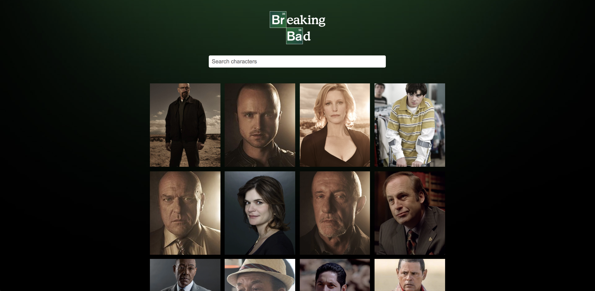

# Breaking Bad UI

A simple React app that fetches data from a Breaking Bad API and displays images of all the characters from the show.

Originally done by Brad Traversy of Traversy Media.

[React App - Breaking Bad API](https://www.youtube.com/watch?v=YaioUnMw0mo)

[Traversy Media Github Link](https://github.com/bradtraversy/breaking-bad-cast)

[Breaking Bad API Documentation](https://breakingbadapi.com/documentation)

___

This project was bootstrapped with [Create React App](https://github.com/facebook/create-react-app).

## Available Scripts

In the project directory, you can run:

### `yarn start`

Runs the app in the development mode. 
Open [http://localhost:3000](http://localhost:3000) to view it in the browser.

The page will reload if you make edits. 
You will also see any lint errors in the console.